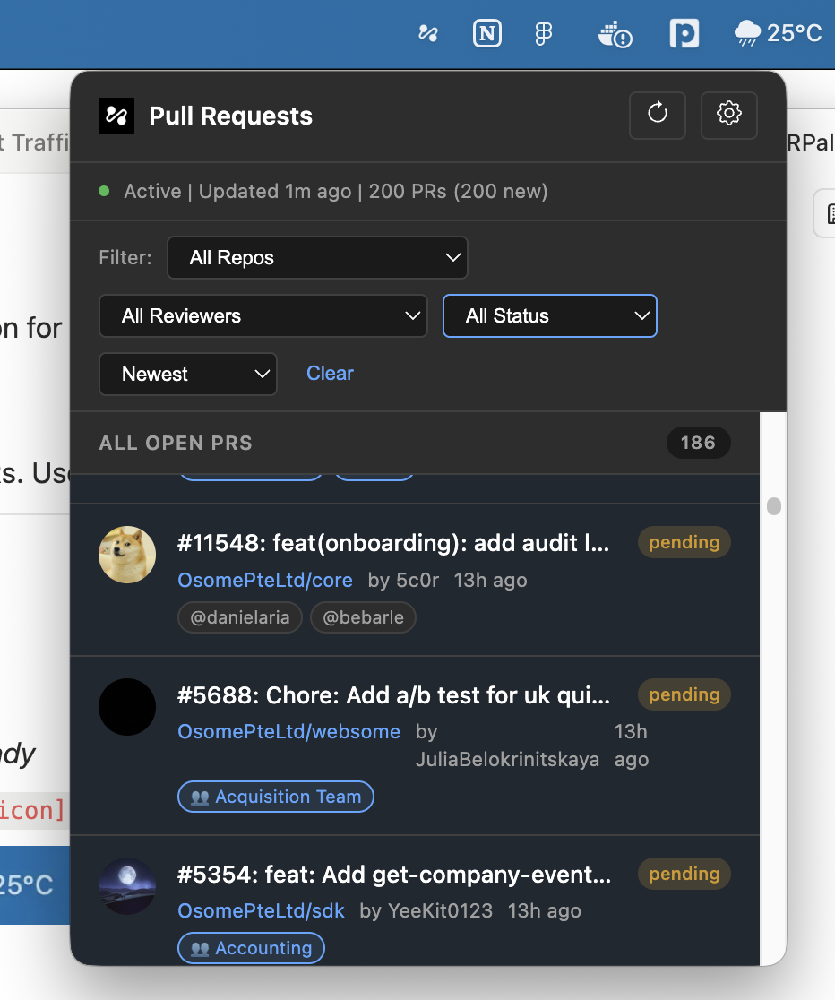
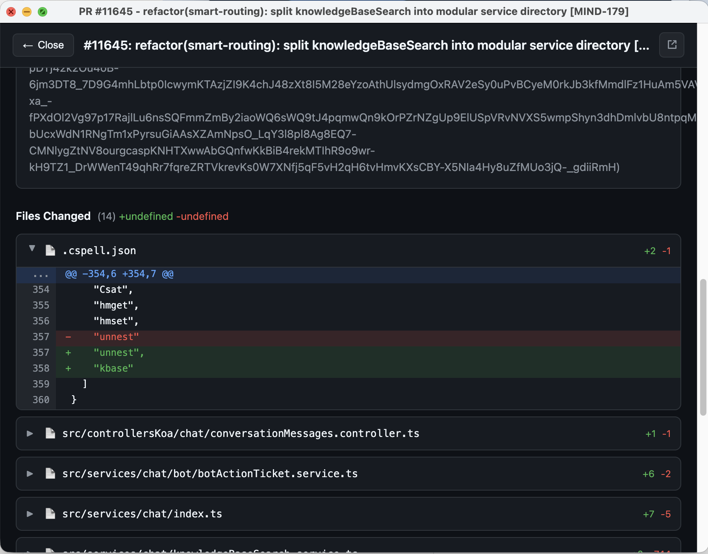
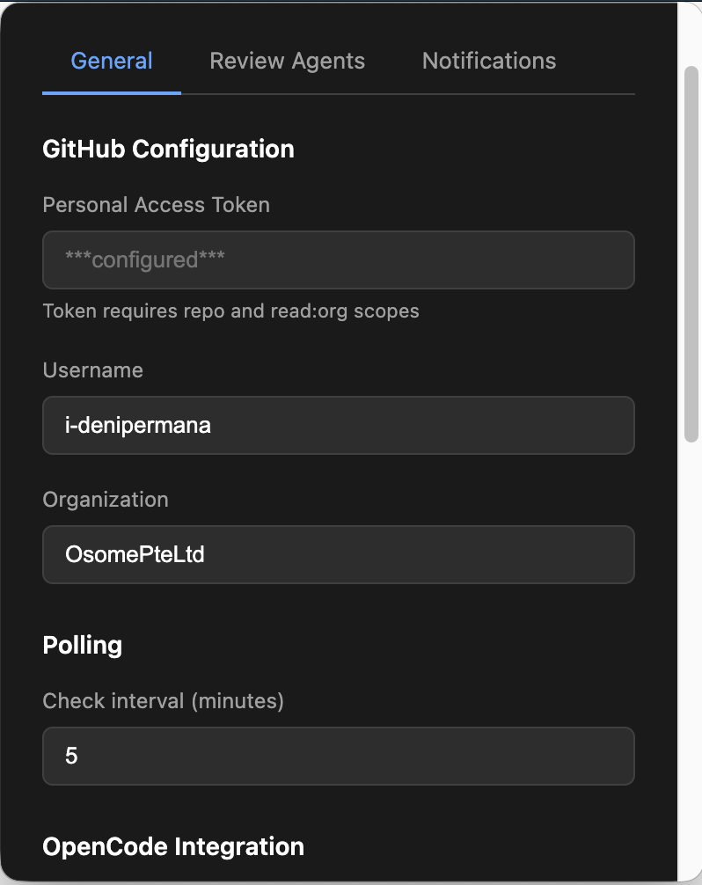
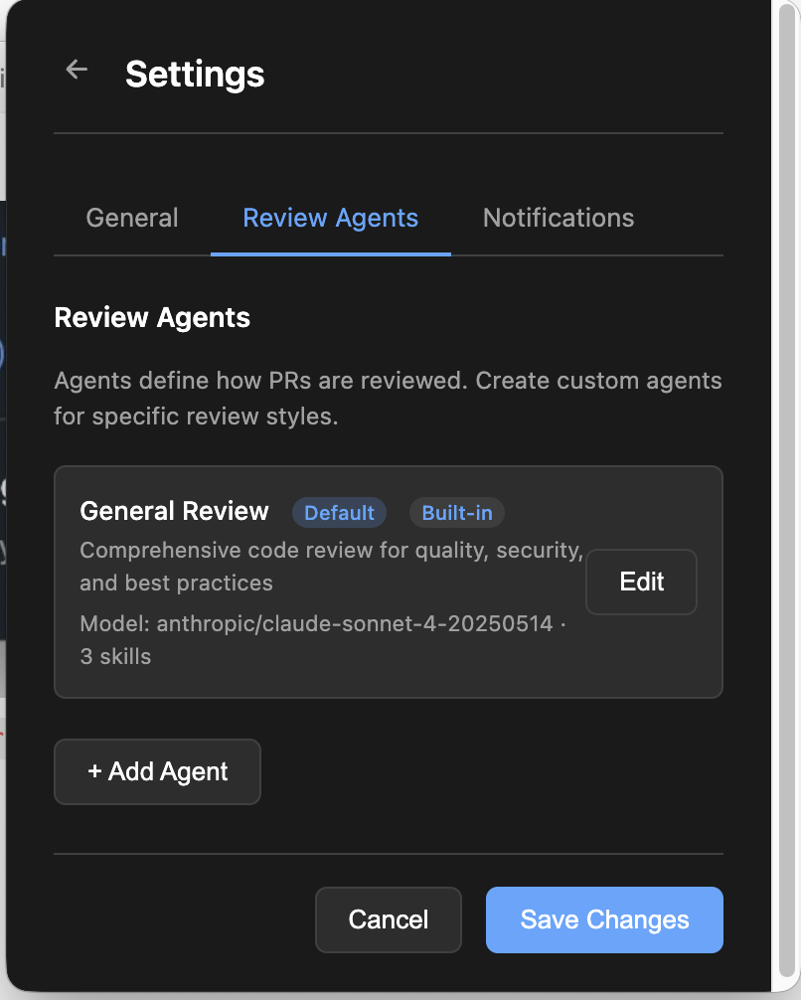

# PRPal

**Your AI-Powered PR Review Companion**

A powerful macOS menu bar application that monitors GitHub pull requests from your organization and provides AI-powered code reviews using OpenCode CLI with Claude AI models.

<p align="center">
  
</p>

## Overview

PRPal streamlines your code review workflow by:

- **Living in your menu bar** - Always accessible, never intrusive
- **Monitoring your organization's PRs** - Automatically detects PRs where you're requested as a reviewer
- **Providing AI-powered reviews** - Leverages OpenCode CLI with Claude for intelligent code analysis
- **Keeping you in control** - Reviews require your approval before posting to GitHub

## Features

| Feature                   | Description                                                                         |
| ------------------------- | ----------------------------------------------------------------------------------- |
| **Menu Bar Integration**  | Native macOS menu bar app with badge notifications                                  |
| **Desktop Notifications** | Get notified when you're requested to review a PR                                   |
| **Team Detection**        | Automatically detects your team memberships and shows relevant PRs                  |
| **AI-Powered Reviews**    | Uses OpenCode CLI with Claude for comprehensive code analysis                       |
| **Custom Review Agents**  | Create specialized agents for different review styles (security, performance, etc.) |
| **Skills System**         | Built-in and custom skills to focus AI reviews on specific concerns                 |
| **Review Preview**        | Review and edit AI suggestions before posting to GitHub                             |
| **Inline Comments**       | Posts file-specific comments directly on the relevant lines                         |

## Screenshots

### Menu Bar Integration

PRPal sits in your macOS menu bar, always ready.


### PR List View

See all PRs organized by priority with powerful filters.



### PR Detail View

Full PR details with syntax-highlighted diff view.



### Settings

Easy configuration with multiple tabs.

| General Settings                                               | Review Agents                                                       |
| -------------------------------------------------------------- | ------------------------------------------------------------------- |
|  |  |

## Quick Start

### Prerequisites

- **macOS 12.0** or later
- **Node.js 20.0** or later
- **[OpenCode CLI](https://opencode.ai)** installed and configured
- **GitHub Personal Access Token** with `repo` and `read:org` scopes

### Installation

```bash
# Clone the repository
git clone <repository-url> prpal
cd prpal

# Install dependencies
npm install

# Configure (interactive setup on first run)
npm run dev:electron
```

The app will guide you through an onboarding wizard on first launch to configure your GitHub credentials.

### Manual Configuration

Create a `.env` file or `~/.config/prpal/settings.json`:

```env
# Required
GITHUB_PAT=ghp_xxxxxxxxxxxxxxxxxxxx
GITHUB_USERNAME=your-username
GITHUB_ORG=YourOrganization

# Optional
POLL_INTERVAL_MS=300000
SERVER_PORT=3847
OPENCODE_ENABLED=true
LOG_LEVEL=info
```

See [Setup Guide](docs/SETUP.md) for detailed configuration options.

## Usage

### Running the Application

```bash
# Development mode (with hot reload)
npm run dev:electron

# Production mode
npm run build
npm run start:electron
```

### Using the Menu Bar App

1. **Click the tray icon** to view pending PRs
2. **Click a PR** to open the detail view
3. **Click "Review with AI"** to generate an AI review
4. **Review and edit** the AI's suggestions
5. **Click "Post Review"** to submit to GitHub

### Keyboard Shortcuts

- **Right-click tray icon** - Access context menu (Settings, Refresh, Quit)
- **Cmd+Q** (when detail window focused) - Close window

## Documentation

| Document                                   | Description                             |
| ------------------------------------------ | --------------------------------------- |
| [Setup Guide](docs/SETUP.md)               | Detailed installation and configuration |
| [API Reference](docs/API.md)               | REST API documentation                  |
| [Architecture](docs/ARCHITECTURE.md)       | System design and code structure        |
| [Review Agents](docs/AGENTS.md)            | Creating custom AI review agents        |
| [Development Guide](docs/DEVELOPMENT.md)   | Contributing and development setup      |
| [Troubleshooting](docs/TROUBLESHOOTING.md) | Common issues and solutions             |

## Configuration Reference

### Environment Variables

| Variable              | Required | Default                              | Description                  |
| --------------------- | -------- | ------------------------------------ | ---------------------------- |
| `GITHUB_PAT`          | Yes      | -                                    | GitHub Personal Access Token |
| `GITHUB_USERNAME`     | Yes      | -                                    | Your GitHub username         |
| `GITHUB_ORG`          | Yes      | -                                    | Organization to monitor      |
| `POLL_INTERVAL_MS`    | No       | `300000`                             | Polling interval (5 min)     |
| `SERVER_PORT`         | No       | `3847`                               | Local API server port        |
| `OPENCODE_ENABLED`    | No       | `true`                               | Enable AI reviews            |
| `OPENCODE_MODEL`      | No       | `anthropic/claude-sonnet-4-20250514` | AI model to use              |
| `OPENCODE_TIMEOUT_MS` | No       | `120000`                             | Review timeout (2 min)       |
| `LOG_LEVEL`           | No       | `info`                               | Logging verbosity            |

### JSON Configuration

```json
{
  "github": {
    "pat": "ghp_xxxxxxxxxxxx",
    "username": "your-username",
    "org": "YourOrganization"
  },
  "polling": {
    "intervalMs": 300000
  },
  "server": {
    "port": 3847,
    "host": "127.0.0.1"
  },
  "opencode": {
    "enabled": true,
    "model": "anthropic/claude-sonnet-4-20250514",
    "timeoutMs": 120000,
    "autoReview": true,
    "skillsFolder": "~/.config/prpal/skills",
    "memoriesFolder": "~/.config/prpal/memories"
  },
  "notification": {
    "enabled": true,
    "sound": true
  },
  "reviewFormat": {
    "style": "standard",
    "attribution": "subtle"
  },
  "logLevel": "info"
}
```

## Project Structure

```
prpal/
├── src/
│   ├── electron.ts          # Electron main process entry
│   ├── index.ts             # CLI/server-only entry
│   ├── config/              # Configuration loading
│   ├── menubar/             # Electron tray/menubar components
│   ├── renderer/            # HTML/CSS/JS UI files
│   ├── server/              # Fastify REST API
│   │   └── routes/          # API endpoint handlers
│   ├── services/
│   │   ├── github/          # GitHub API integration
│   │   ├── opencode/        # OpenCode CLI integration
│   │   ├── notification/    # Desktop notifications
│   │   ├── polling/         # PR polling scheduler
│   │   └── state/           # In-memory state stores
│   ├── types/               # TypeScript type definitions
│   └── utils/               # Logging, retry, time utilities
├── assets/                  # App icons
├── docs/                    # Documentation
└── scripts/                 # Build scripts
```

## Development

```bash
# Run tests
npm test

# Run tests with coverage
npm run test:coverage

# Type check
npm run typecheck

# Lint
npm run lint

# Format code
npm run format

# Build for distribution
npm run dist
```

## API Overview

The app exposes a local REST API on port 3847:

| Method | Endpoint                 | Description               |
| ------ | ------------------------ | ------------------------- |
| `GET`  | `/health`                | Health check              |
| `GET`  | `/api/status`            | App status with PR counts |
| `GET`  | `/api/prs`               | List all tracked PRs      |
| `GET`  | `/api/prs/:id`           | Get PR details with diff  |
| `POST` | `/api/review/:prId`      | Start AI review           |
| `POST` | `/api/review/:prId/post` | Post review to GitHub     |
| `GET`  | `/api/agents`            | List review agents        |

See [API Documentation](docs/API.md) for complete reference.

## Technology Stack

| Category           | Technology                       |
| ------------------ | -------------------------------- |
| **Runtime**        | Electron 34, Node.js 20+         |
| **UI Framework**   | Native HTML/CSS/JS               |
| **API Server**     | Fastify 5                        |
| **HTTP Client**    | ofetch                           |
| **Validation**     | Zod 4                            |
| **AI Integration** | OpenCode CLI                     |
| **Notifications**  | node-notifier                    |
| **Logging**        | Pino                             |
| **Testing**        | Vitest, MSW                      |
| **Build**          | TypeScript 5.9, electron-builder |

## Security Considerations

- **Local-only API** - The REST API binds to `127.0.0.1` only
- **Token security** - GitHub PAT is stored locally and never transmitted except to GitHub
- **Review approval** - AI reviews require human approval before posting
- **Limited AI permissions** - OpenCode runs with restricted file/bash access

## Contributing

See [CONTRIBUTING.md](CONTRIBUTING.md) for guidelines on contributing to this project.

## License

MIT

## Acknowledgments

- [OpenCode](https://opencode.ai) for AI-powered code analysis
- [Electron](https://www.electronjs.org/) for cross-platform desktop apps
- [menubar](https://github.com/maxogden/menubar) for menu bar integration

---

<p align="center">
  Made with care by the PRPal team
</p>
